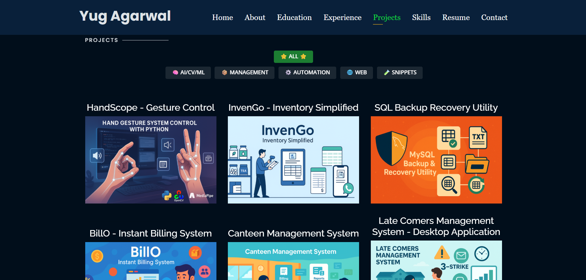

# Personal Portfolio 🔥
> **Website Link:** https://helloyug.github.io/

---

[](https://github.com/HelloYug/HelloYug.github.io)
[](https://helloyug.github.io/)
[](https://www.linkedin.com/in/yugagarwal704/)

---

## 👨‍💻 About Me
AI-focused Computer Science undergraduate with experience in backend development, research analysis, and business operations. Built 10+ AI, automation, and CV projects using Python, MySQL, and OpenCV. Interned at Tranquiex, Nebulyn, and Medipol, contributing to backend modules, market research, and operational workflows. Skilled in Python, Java, DSA, SQL, and design tools, backed by Google, CISCO, and NPTEL certifications, and active in leadership roles at college.

---

## 🌐 Website Preview
### Home Page


### About Page


### Projects Page


---

## 📋 Features
⚡️ Fully Responsive Design - Works seamlessly on desktop, tablet, and mobile\
⚡️ Valid HTML5 & CSS3 - Clean, semantic code following web standards\
⚡️ Dynamic Typing Animation - Using `Typed.js` for engaging hero section\
⚡️ Smooth Scrolling & Animations - Enhanced UX with AOS (Animate On Scroll)\
⚡️ Project Filtering System - Interactive category-based project showcase\
⚡️ SEO Optimized - Meta tags, structured data, and Open Graph integration\
⚡️ Google Analytics Integration - Track visitor engagement and behavior\
⚡️ Random Profile Picture - Dynamic profile image rotation on page load\
⚡️ Easy to Customize - Well-organized code structure for quick modifications

---

## 🏷️ Project Categories
Projects are organized into the following categories for easy navigation:
- 🧠 **AI/CV/ML** - Artificial Intelligence, Computer Vision, Machine Learning
- 💡 **IoT** - Internet of Things and Hardware Integration
- 📦 **Management** - Business and Operations Management Systems
- ⚙️ **Automation** - Task Automation and Scripting Tools
- 🌐 **Web** - Web Applications and Full-Stack Projects
- 🧪 **Snippets** - Code Snippets, Mini Projects, and Fun Tools

---

## 📂 Project Structure
```
HelloYug.github.io/
├── assets/
│   ├── certs/              # Certification PDFs and images
│   ├── css/                # Custom stylesheets
│   ├── favicon_io/         # Favicon files
│   ├── img/                # Images (profile, projects, education, skills)
│   ├── js/                 # JavaScript files (main.js, randomProfilePic.js)
│   └── vendor/             # Third-party libraries (Bootstrap, jQuery, etc.)
├── projects/               # Individual project detail pages (HTML files)
├── website_images/         # README preview images
├── index.html              # Main portfolio page
├── resume.html             # Resume page
├── YugAgarwal.pdf          # Downloadable resume
├── .gitignore              # Git ignore rules
└── README.md               # This file
```

---

## 📦 Installation & Deployment

### Local Setup
1. **Clone the repository**
   ```bash
   git clone https://github.com/HelloYug/HelloYug.github.io.git
   cd HelloYug.github.io
   ```

2. **Open in browser**
   - Simply open `index.html` in your web browser
   - Or use a local server (recommended):
   ```bash
   # Using Python
   python -m http.server 8000
   
   # Using Node.js
   npx http-server
   ```

3. **Customize content**
   - Modify `index.html` for main content
   - Update images in `assets/img/` directory
   - Add/edit project pages in `projects/` folder
   - Update resume in `resume.html` and `YugAgarwal.pdf`

### GitHub Pages Deployment
1. **Create a GitHub repository**
   - Repository name must be: `<your-github-username>.github.io`
   - Example: If your username is `johndoe`, create `johndoe.github.io`

2. **Push your code**
   ```bash
   git init
   git add .
   git commit -m "Initial commit"
   git branch -M main
   git remote add origin https://github.com/<your-username>/<your-username>.github.io.git
   git push -u origin main
   ```

3. **Enable GitHub Pages**
   - Go to repository Settings → Pages
   - Source: Deploy from branch `main` (or `master`)
   - Your site will be live at `https://<your-username>.github.io/`

### Customization Guide
- **Profile Pictures**: Add images to `assets/img/` and update `randomProfilePic.js`
- **Projects**: Create new HTML files in `projects/` folder following existing templates
- **Certifications**: Add certificates to `assets/certs/` and update the certification section
- **Skills**: Modify the skills section in `index.html`
- **Colors**: Update CSS variables in `assets/css/style.css`
- **Analytics**: Replace Google Analytics ID in `index.html` with your own

---

## 📚 Sections
✔️ **About** - Personal introduction and contact information\
✔️ **Interests** - Key areas of focus including AI, Automation, Programming, Data Analytics\
✔️ **Education** - Academic background from ABESIT, BPVM, and NOPS\
✔️ **Certifications** - 9+ professional certifications from Google, NPTEL, CISCO, TCS iON\
✔️ **Experience** - Internships at Tranquiex, Nebulyn, Medipol Pharmaceuticals, and family business\
✔️ **Projects** - 14+ categorized projects (AI/CV/ML, IoT, Management, Automation, Web, Snippets)\
✔️ **Skills** - Technical proficiencies in languages, frameworks, tools, and platforms\
✔️ **Resume** - Downloadable PDF resume with complete professional details\
✔️ **Contact** - Direct links to LinkedIn, GitHub, and email communication

---

## 🛠️ Tech Stack & Tools

### Frontend
* **HTML5** - Semantic markup with structured data (Schema.org)
* **CSS3** - Custom styling with responsive design principles
* **JavaScript** - Interactive features and dynamic content
* **Bootstrap 4** - Responsive grid system and components
* **Typed.js** - Typing animation library
* **AOS (Animate On Scroll)** - Scroll-triggered animations
* **Owl Carousel** - Touch-enabled carousel slider
* **Isotope** - Filter and sort layouts
* **Venobox** - Responsive lightbox plugin

### Icons & Fonts
* **Boxicons** - Modern icon library
* **Icofont** - Additional icon set
* **RemixIcon** - Open-source icon system
* **Google Fonts** - Open Sans, Raleway, Poppins

### Analytics & SEO
* **Google Analytics** - Visitor tracking and insights
* **Google Tag Manager** - Tag management system
* **Open Graph Protocol** - Social media preview optimization
* **Twitter Cards** - Enhanced Twitter sharing

### Hosting & Deployment
* **GitHub Pages** - Free static site hosting
* **Git** - Version control system

---

## Contributing 💡
- **Step 1:** 🍴👯 Fork this repo or Clone this repo to your local machine
- **Step 2:** 🔨 Build your code
- **Step 3:** 🔃 Create a new pull request.

---

## 🔍 Key Features Explained

### Dynamic Profile Picture
The portfolio includes a random profile picture feature that cycles through multiple images on each page load, adding a dynamic touch to the hero section.

### Project Filtering System
Projects are categorized and can be filtered by:
- All Projects
- AI/CV/ML
- IoT
- Management Systems
- Automation Tools
- Web Applications
- Code Snippets

### SEO Optimization
- Structured data using Schema.org vocabulary
- Open Graph meta tags for social media sharing
- Twitter Card integration
- Canonical URLs
- Optimized meta descriptions and keywords

### Responsive Design
- Mobile-first approach
- Breakpoints for tablets and desktops
- Touch-friendly navigation
- Optimized images for different screen sizes

---

## ⚡ Performance Optimization
- Minified CSS and JavaScript
- Optimized images
- Lazy loading for images
- Async loading for analytics scripts
- CDN for vendor libraries

---

## ⚖️ License
This project uses the [Personal Bootstrap Template](https://bootstrapmade.com/personal-free-resume-bootstrap-template/) by BootstrapMade.com

---

## 👨‍💻 Author

**Yug Agarwal**

* 📧 [yugagarwal704@gmail.com](mailto:yugagarwal704@gmail.com)
* 🔗 GitHub – [@HelloYug](https://github.com/HelloYug)

<!-- 
## Future Enhancements 🔮
- [ ] Dark mode toggle
- [ ] Blog section for technical articles
- [ ] Interactive skill visualization
- [ ] Project search functionality
- [ ] Multi-language support
- [ ] Contact form with backend integration
- [ ] Testimonials section
- [ ] Achievement timeline -->